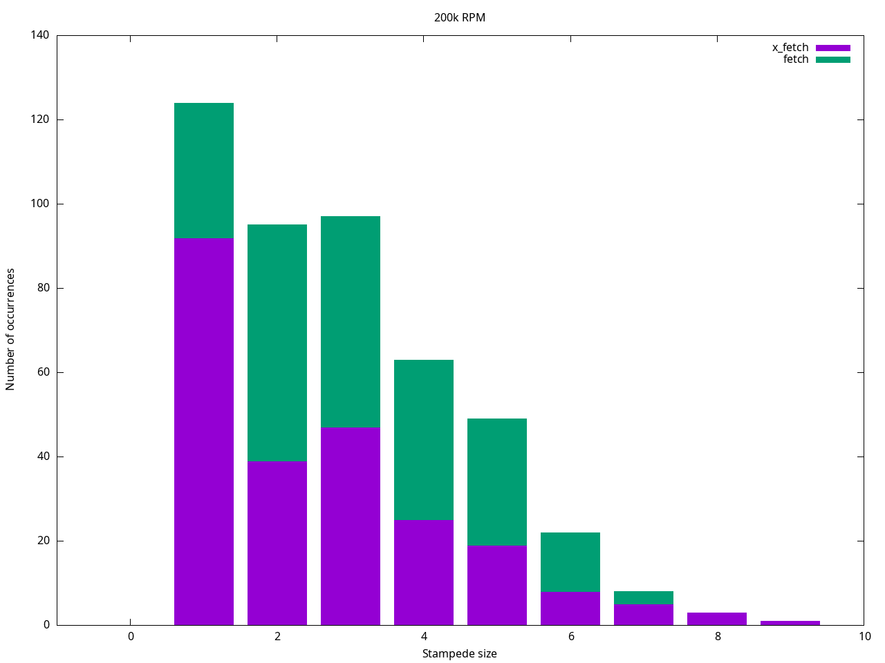
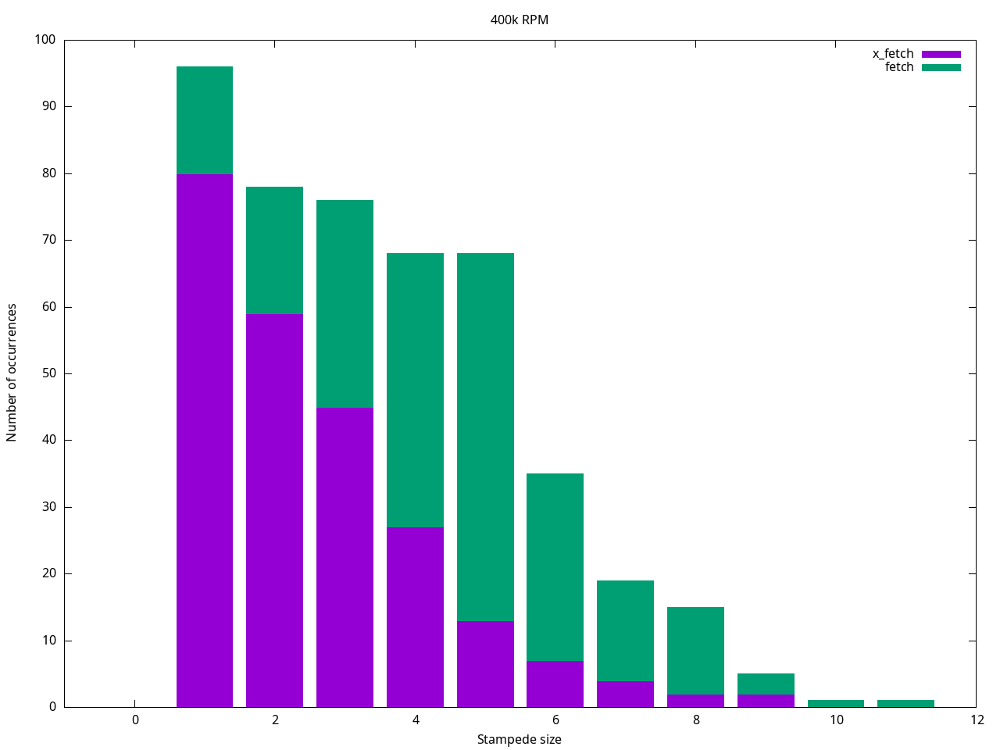
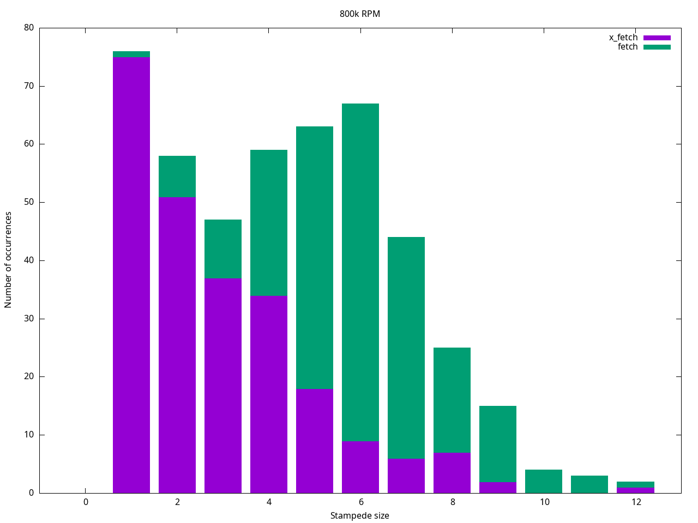

= Cache Stampede Solution Benchmark in Ruby on Rails: `race_condition_ttl` vs probabilistic early expiration

This project is a benchmark to compare the performance between `race_condition_ttl` and probabilistic early expiration to solve the cache stampede problem.

The probabilistic early expiration approach is a technique to avoid the cache stampede by expiring the cache before the TTL based on the paper, link:assets/cache_stampede.pdf[Optimal Probabilistic Cache Stampede Prevention].
This technique is implemented in the method `ActiveSupport::Cache::Store#fetch(early_expiration: true)` in the file link:lib/active_support_cache_store_extension.rb[`lib/active_support_cache_store_extension.rb`]

== Benchmark

The following command runs the benchmark for 1 hour and generates stacked histograms comparing stampede size between `:race_condition_ttl` and `:early_expiration`:

[source,sh]
----
docker-compose run --name benchmark -e TIMEOUT=3600 ruby \
  rake output/200k_histogram.png \
       output/400k_histogram.png \
       output/800k_histogram.png
docker cp benchmark:/app/output .
----

Here is the result of the benchmark on my machine (MacOS Sonoma Version 14.2.1/2.4 GHz 8-Core Intel Core i9/32 GB 2667 MHz DDR4):

As the histograms show, `early_expiration` has a smaller stampede size than `fetch` in all cases.
The higher the RPM, the more significant the difference.

== Environment Variables

You can tune the benchmark by setting the following environment variables:

|===
| Name | Description | Default

| TTL
| THe time to live of the cache
| 15

| REGENERATION_TIME
| The time it takes to regenerate the cache
| 1

| NUMBER_OF_THREADS
| The number of threads to use.
Each thread is a infinite loop that calls the method `fetch` until `TIMEOUT` is reached.
| (number of cores)

| TIMEOUT
| The time to run the benchmark
| 60

| REDIS_URL
| The redis URL
| redis://localhost

| FETCH_METHOD
| Enum of `x_fetch` or `fetch`.

`fetch` uses `race_condition_ttl` appraoch and `x_fetch` uses probabilistic early expiration approach.
| x_fetch

| RPM
| The number of `FETCH_METHOD` calls per minute
| 200000

| WINDOW_SIZE
| The interval in seconds to record cache stampede size.
It sould be equal or larger than `TTL`.
| 15
|===
